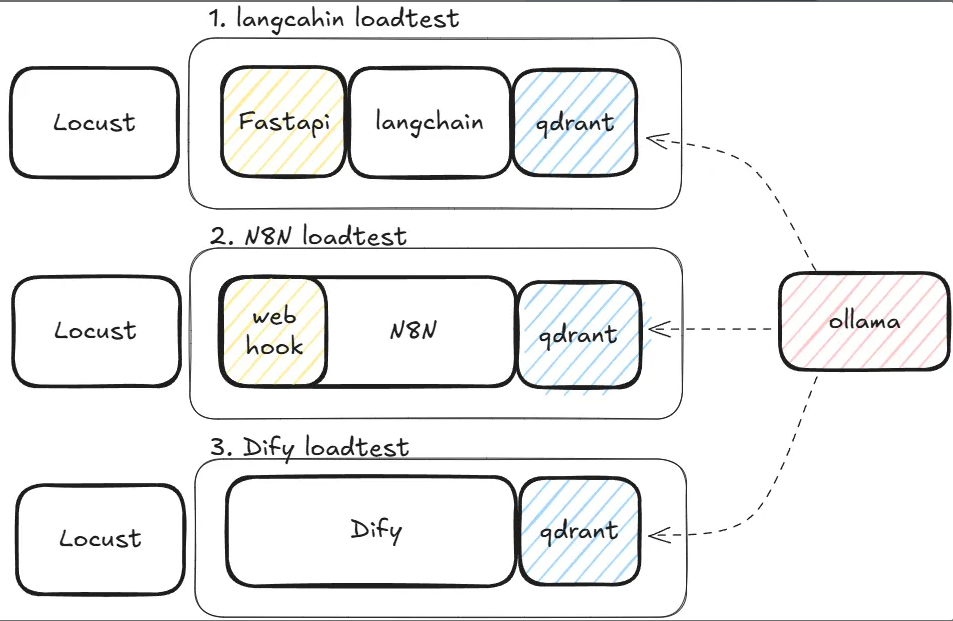

# Workflow Automation Tools Loadtest

이 프로젝트의 목적은 **langchain**, **n8n**, **dify**가 PDF 기반 RAG(Retrieval-Augmented Generation) 챗봇 워크플로우에서 얼마나 높은 부하를 견디는지(내구성, 확장성, 안정성 등) 비교·평가하는 것입니다.

## 요약
| 플랫폼 | 요청 수 | 실패 수 | 평균 응답시간 | 최소 응답시간 | 최대 응답시간 | 평균 응답 크기 | RPS | 실패율 |
| --- | --- | --- | --- | --- | --- | --- | --- | --- |
| LangChain | 82 | 18 | 15,887.95 | 1,767 | 30,004 | 370.91 | 0.73 | 0.16 |
| n8n | 53 | 9 | 18,653.60 | 2,653 | 30,029 | 226.32 | 0.60 | 0.10 |
| dify | 163 | 0 | 4,563.73 | 452 | 7,269 | 340.08 | 1.82 | 0 |

- **dify**가 가장 높은 부하(RPS 1.82, 실패율 0)에서도 안정적으로 동작합니다.
- **LangChain**과 **n8n**은 요청 수와 RPS가 dify보다 낮고, 실패율이 존재합니다.
- 평균 응답시간도 dify가 가장 짧아, 성능과 안정성 모두 dify가 우수함을 알 수 있습니다.

## 주의사항
- **모든 테스트는 매우 짧은 기간 내에 개발되었으며, 완벽하게 동일한 조건이 아닐 수 있습니다.**
- **최대한 동일한 조건에서 테스트를 진행하기 위해 노력했습니다.**
- 특히 **LangChain**은 최적화 개발이 충분히 진행되지 않은 상태에서 테스트되었습니다.
- 그럼에도 불구하고 **dify**는 짧은 개발 기간 대비 매우 높은 효율과 안정성을 보여, 실전 경쟁력이 있음을 확인할 수 있습니다.

## 실험 개요
- **테스트베드:** PDF 기반 RAG 챗봇
- **비교 대상:** [langchain](https://github.com/hwchase17/langchain), [n8n](https://github.com/n8n-io/n8n), [dify](https://github.com/langgenius/dify)
- **평가 방법:** 각 프레임워크별로 서버 실행 → 로드테스트 → 리소스 정리 과정을 반복하며, 동일 조건에서 부하 내성(Load Tolerance)을 측정
- **실험 구조도:**
    

---
### Prerequisites
1. ollama 실행
```bash
make ollama-up
```

### langchain

1. 서버 실행
```bash
make qdrant-up         # qdrant 서버 실행
make langchain-up      # langchain 서버 실행 + knowledge base 초기화
```
2. 로드테스트
```bash
make loadtest          # 로드테스트 수행 (프롬프트에서 '1' 선택)
```
3. 리소스 정리
```bash
make langchain-down    # 리소스 정리
make qdrant-down       # qdrant 리소스 정리
```
4. 결과
- [Locust - langchain.pdf](./assets/Locust%20-%20langchain.pdf)

### n8n

1. 서버 실행
```bash
make qdrant-up         # qdrant 서버 실행
make n8n-up            # n8n 서버 실행
```
2. workflow 로드
- n8n 웹 UI 접속(`http://localhost:5678`)
- `n8n/pdf_chat.json` 파일을 로드하여 워크플로우 저장

3. 로드테스트
```bash
make n8n-pdf-init      # knowledge base 초기화
make loadtest          # 로드테스트 수행 (프롬프트에서 '2' 선택)
```
4. 리소스 정리
```bash
make n8n-down          # 리소스 정리
make qdrant-down       # qdrant 리소스 정리
```
5. 결과
- [Locust - n8n.pdf](./assets/Locust%20-%20n8n.pdf)

### dify

1. 서버 실행
```bash
make dify-up           # dify 서버 실행(dify는 자동으로 qdrant 서버를 실행)
```
2. workflow 로드
- dify 웹 UI 접속(`http://localhost/install`)
- 지식 탭에서 `pdfs/sample.pdf`를 업로드하여 knowledge base 초기화
- `dify/pdf_chat.json` 파일을 로드하여 워크플로우 저장 및 지식베이스 등록
- `example.env` 파일을 복사하여 `.env` 파일 생성
- dify api 토큰을 `.env` 파일에 추가

3. 로드테스트
```bash
make loadtest          # 로드테스트 수행 (프롬프트에서 '3' 선택)
```
4. 리소스 정리
```bash
make dify-down         # 리소스 정리
make qdrant-down       # qdrant 리소스 정리 (bug: dify는 qdrant리소스 정리가 안됨)
```
5. 결과
- [Locust - dify.pdf](./assets/Locust%20-%20dify.pdf)

### clean up
1. ollama 종료
```bash
make ollama-down
```

---

각 프레임워크별로 위 3단계를 독립적으로 수행하여, 동일 조건에서 부하 내성을 비교합니다.

- **로드테스트(loadtest)**: PDF 기반 RAG 챗봇에 반복적으로 질의하여, 각 프레임워크가 얼마나 많은 요청을 견디는지 측정합니다.
- **결과**는 locust의 dashboard(`http://localhost:8089`)에서 확인해주세요.

## 주요 명령어 요약

| 명령어             | 설명                                |
|--------------------|-------------------------------------|
| make qdrant-up     | qdrant 서버 실행                    |
| make n8n-pdf-init  | n8n knowledge base 초기화           |
| make langchain-up  | langchain 서버 실행                 |
| make n8n-up        | n8n 서버 실행                       |
| make dify-up       | dify 서버 실행                      |
| make langchain-down| langchain 리소스 정리               |
| make n8n-down      | n8n 리소스 정리                     |
| make dify-down     | dify 리소스 정리                    |
| make loadtest      | 부하 테스트(내구성 비교) 실행       |
